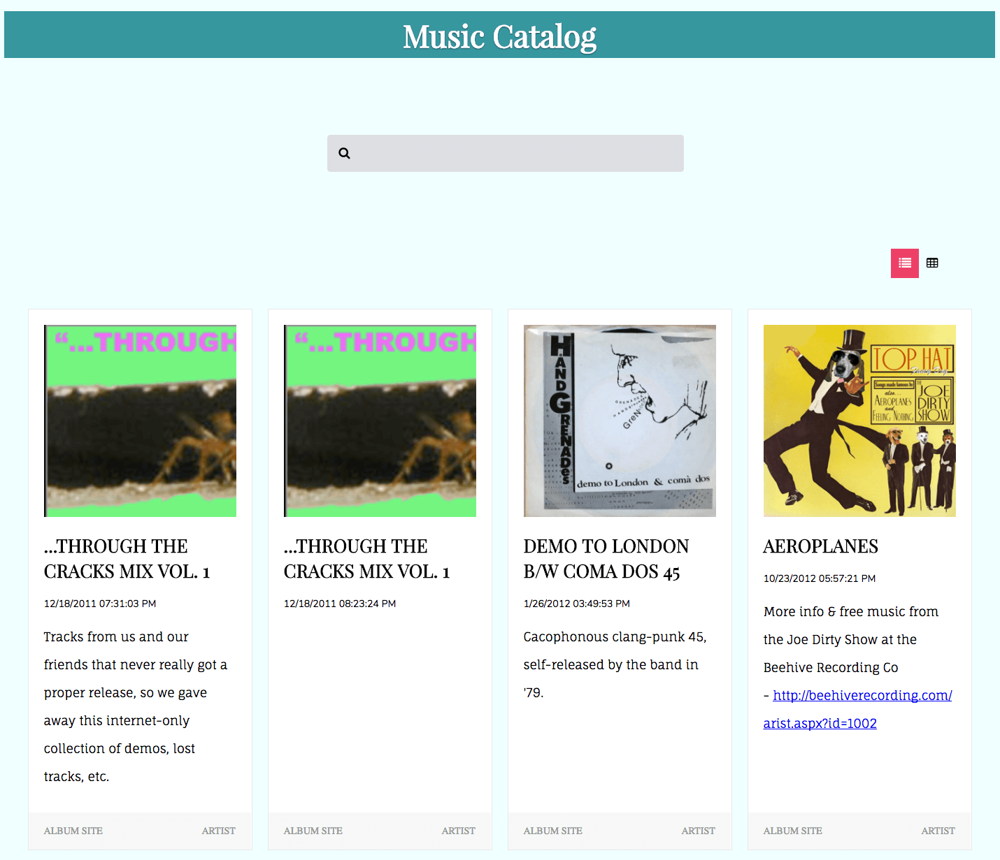
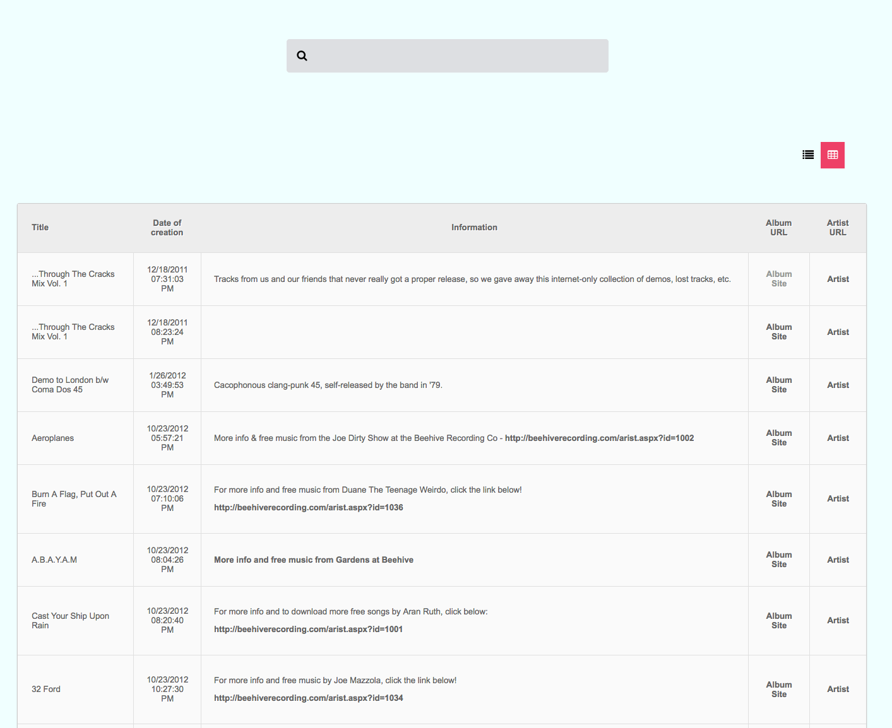
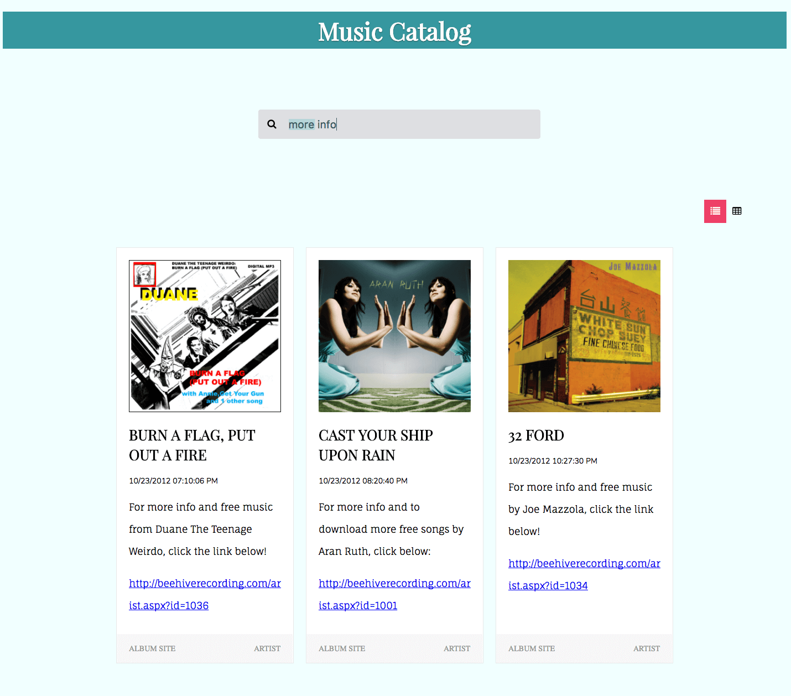

## Project Assignment 1:  Music Catalog

Create a simple music catalog that displays albums. Each album should be stored as an IndexedDB record, with properties for the album name, artist, track list, etc. The first time a user visits the page, the data may be downloaded from a server (hint: Use an online API such as Free Music Archive and then stored in IndexedDB. Subsequent visits to the page should load the data from IndexedDB.

The Music Catalog project I developed makes use of IndexedDB as well as the sessionStorage object for holding the user preference about the main view.

Long text descriptions are cut, and the system shows a Show More link so that the user can see the remaining text.

A user can switch between the list and table view using the appropriate button.

I added the search capability too so that a user can seek a particular text within Albums titles and descriptions.

[Live-page](http://gabrieleromeo.github.io/Bov-Projects/Course-08-Building-high-performance-modern-javascript-web-applications/chapter-08-Frontend-Datastore/music-catalog)

